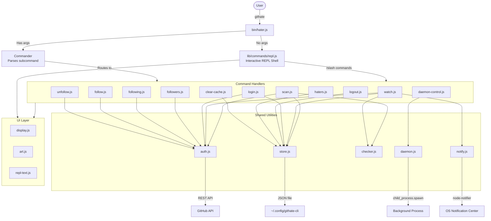
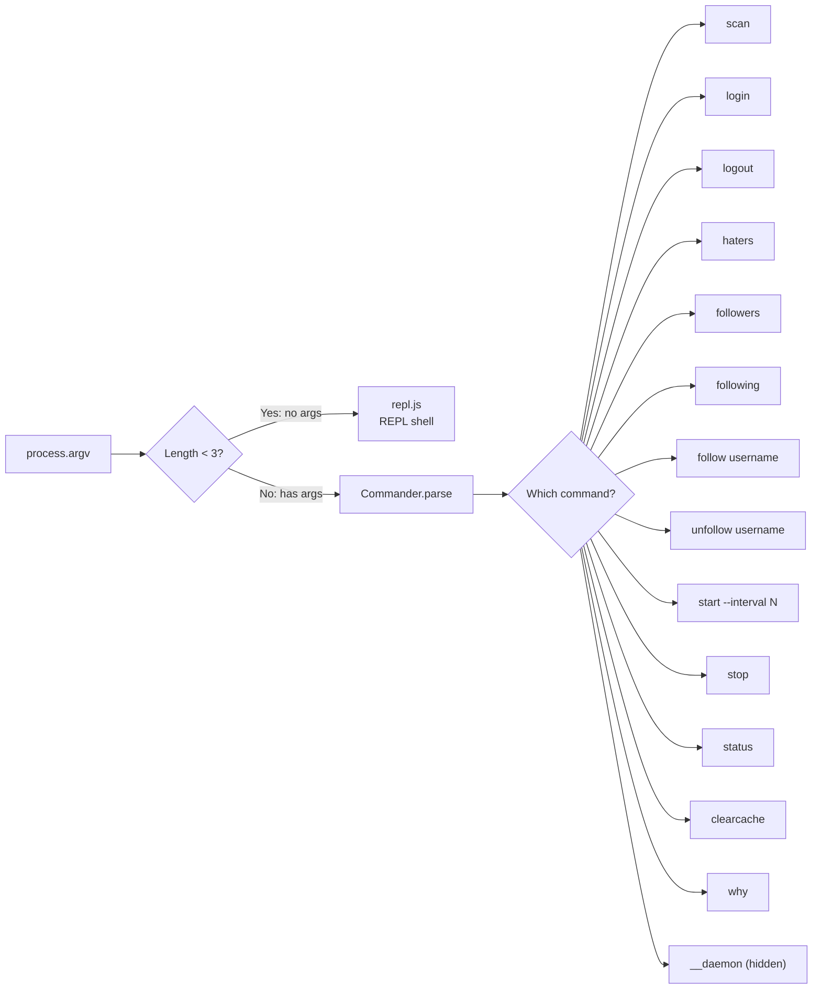
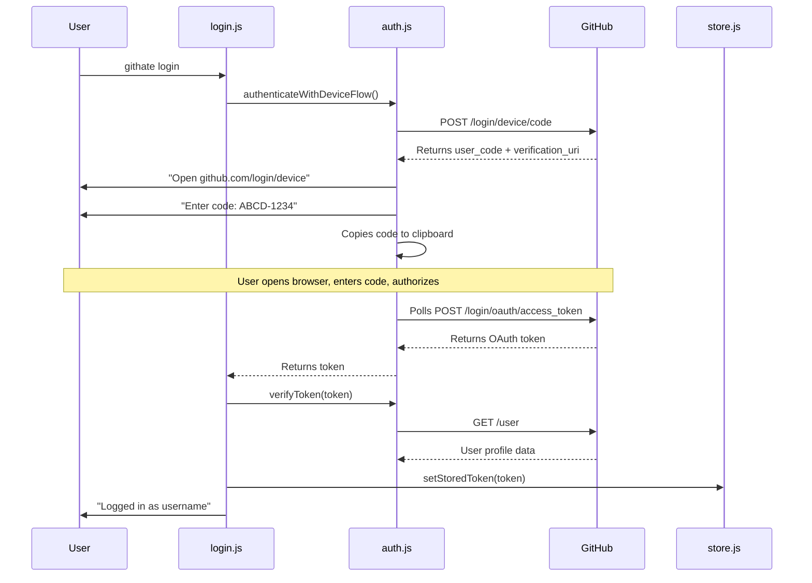
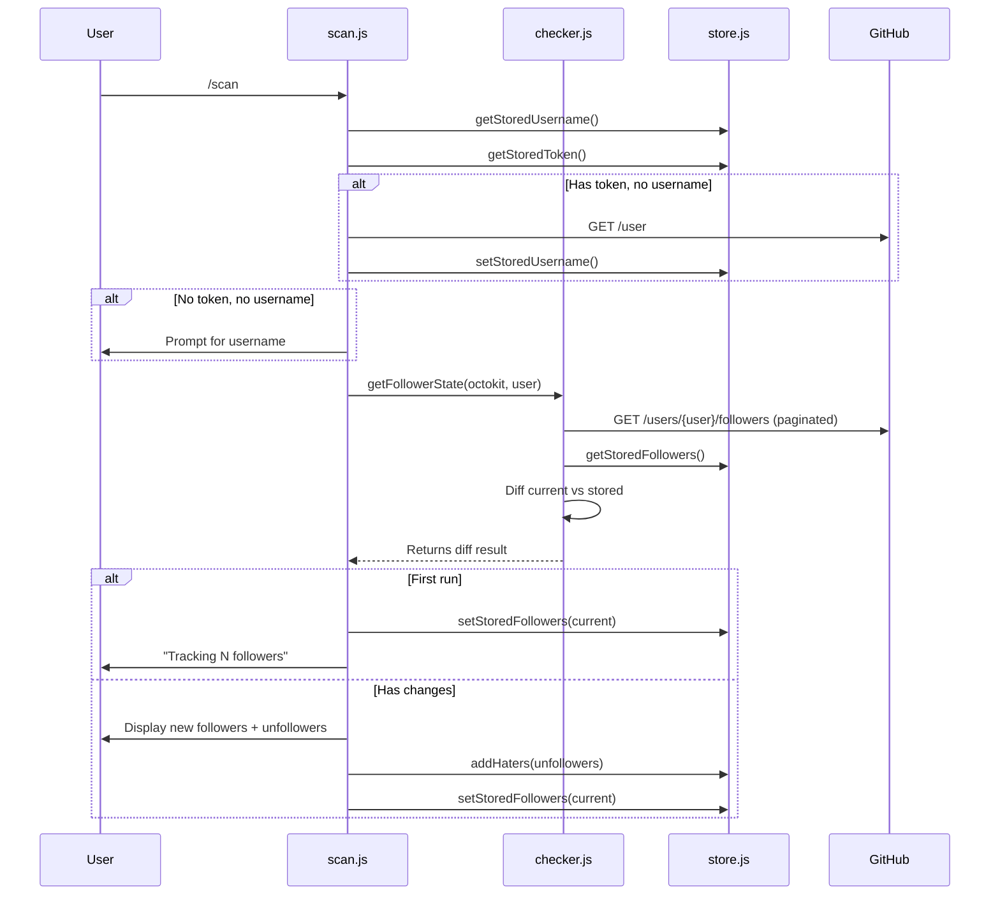
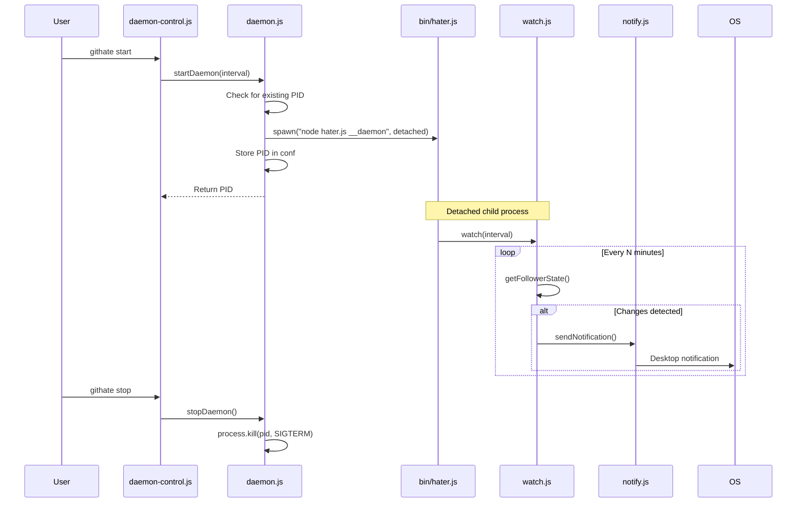
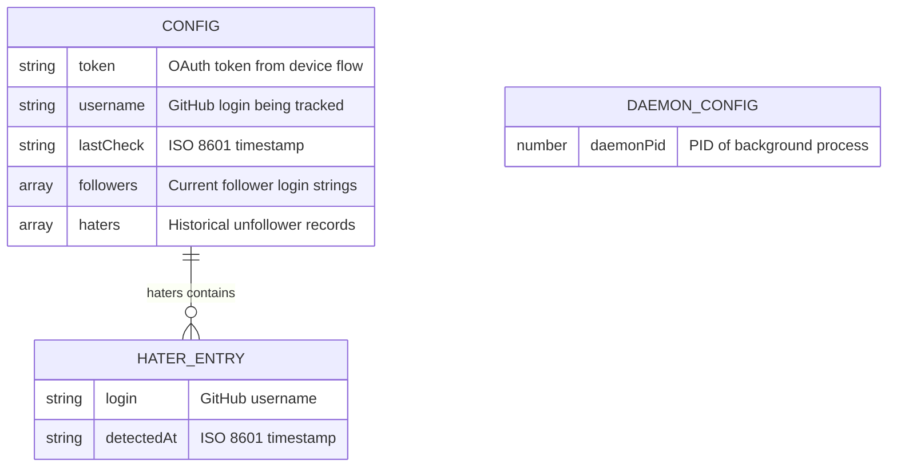

# GitHate CLI v1.3.1 — Complete Architecture & Code Guide

> **Goal:** Explain every file, every connection between files, every API call, and every design decision so you could rebuild this from scratch without AI.

---

## Table of Contents

1. [Project Overview](#1-project-overview)
2. [Dependencies](#2-dependencies)
3. [Architecture — L0 System Overview](#3-architecture--l0-system-overview)
4. [Architecture — L1 Subsystem Diagrams](#4-architecture--l1-subsystem-diagrams)
5. [Directory Structure](#5-directory-structure)
6. [Cross-File Connection Map](#6-cross-file-connection-map)
7. [File-by-File Walkthrough](#7-file-by-file-walkthrough)
8. [GitHub API Reference](#8-github-api-reference)
9. [End-to-End Data Flows](#9-end-to-end-data-flows)
10. [How to Rebuild From Scratch](#10-how-to-rebuild-from-scratch)

---

## 1. Project Overview

**GitHate** (`githate`) is a Node.js CLI tool that tracks GitHub unfollowers. It has two modes of operation:

- **Interactive REPL** — Run `githate` with no args, get a persistent shell with `/slash` commands.
- **Direct CLI** — Run `githate scan`, `githate login`, etc. as one-shot commands.

**Core features:**

1. **OAuth Device Flow login** — No copy-pasting tokens. Opens browser, user enters a code.
2. **Scan** — Fetches current followers, diffs against stored list, reveals "haters" (unfollowers).
3. **Hater History** — Persists every unfollower with timestamps. View with `/haters`.
4. **Background Daemon** — Spawns a detached child process that polls GitHub on an interval and sends OS-level desktop notifications when followers change.
5. **REPL Shell** — Full readline-based interactive shell with `/slash` commands, easter eggs, and the ability to drop into a legacy `@clack/prompts` select menu.

---

## 2. Dependencies

| Package                      | Version   | What It Does                                                   | Which Files Use It                                                                                        |
| ---------------------------- | --------- | -------------------------------------------------------------- | --------------------------------------------------------------------------------------------------------- |
| `commander`                  | `^14.0.3` | CLI framework — parses subcommands and flags                   | `bin/hater.js`                                                                                            |
| `@octokit/rest`              | `^20.0.0` | GitHub REST API SDK                                            | `lib/utils/auth.js`                                                                                       |
| `@octokit/auth-oauth-device` | `^8.0.3`  | OAuth Device Flow authentication                               | `lib/utils/auth.js`                                                                                       |
| `conf`                       | `^15.1.0` | Persistent JSON config storage                                 | `lib/utils/store.js`, `lib/utils/daemon.js`                                                               |
| `@clack/prompts`             | `^1.0.0`  | Interactive terminal prompts (select, text, password, spinner) | `lib/commands/scan.js`, `lib/commands/repl.js`, `lib/commands/clear-cache.js`, `lib/commands/watch.js`    |
| `chalk`                      | `^5.6.2`  | Terminal string styling (colors, bold)                         | Almost every file                                                                                         |
| `picocolors`                 | `^1.1.1`  | Lightweight terminal colors                                    | `lib/commands/scan.js`, `lib/commands/followers.js`, `lib/commands/following.js`, `lib/commands/watch.js` |
| `boxen`                      | `^8.0.1`  | Draw boxes around terminal text                                | `lib/ui/display.js`, `lib/commands/scan.js`                                                               |
| `figlet`                     | `^1.10.0` | ASCII art text generation                                      | `lib/ui/art.js`                                                                                           |
| `gradient-string`            | `^3.0.0`  | Apply color gradients to strings                               | `lib/ui/art.js`                                                                                           |
| `clipboardy`                 | `^5.3.0`  | Copy text to system clipboard                                  | `lib/utils/auth.js`                                                                                       |
| `node-notifier`              | `^10.0.1` | Cross-platform OS desktop notifications                        | `lib/utils/notify.js`                                                                                     |
| `dotenv`                     | `^17.3.1` | Load `.env` file into `process.env`                            | `bin/hater.js` (line 2)                                                                                   |

---

## 3. Architecture — L0 System Overview



---

## 4. Architecture — L1 Subsystem Diagrams

### L1-A: Entry Point Routing



### L1-B: OAuth Device Flow Login



### L1-C: Scan Algorithm



### L1-D: Background Daemon Architecture



### L1-E: Data Storage Schema



Storage location:

- **macOS**: `~/Library/Preferences/githate-cli-nodejs/config.json`
- **Linux**: `~/.config/githate-cli-nodejs/config.json`
- **Windows**: `%APPDATA%/githate-cli-nodejs/config.json`

---

## 5. Directory Structure

```
hater/
├── bin/
│   └── hater.js              # CLI entry point (Commander setup + REPL fallback)
├── lib/
│   ├── commands/              # One file per user-facing command
│   │   ├── scan.js            # Core: fetch followers, diff, reveal haters
│   │   ├── login.js           # OAuth Device Flow authentication
│   │   ├── logout.js          # Delete stored token
│   │   ├── haters.js          # Display historical unfollower hall of shame
│   │   ├── followers.js       # List authenticated user's followers
│   │   ├── following.js       # List who authenticated user follows
│   │   ├── follow.js          # Follow a GitHub user
│   │   ├── unfollow.js        # Unfollow a GitHub user
│   │   ├── repl.js            # Interactive REPL shell (readline-based)
│   │   ├── watch.js           # Continuous polling loop (used by daemon)
│   │   ├── daemon-control.js  # Start/stop/status for background service
│   │   └── clear-cache.js     # Wipe all local data
│   ├── ui/                    # Presentation layer
│   │   ├── art.js             # ASCII art generation (figlet + gradient)
│   │   ├── display.js         # Styled console output helpers
│   │   └── repl-text.js       # REPL-specific text (welcome, help, /why)
│   └── utils/                 # Shared business logic
│       ├── auth.js            # Octokit client + OAuth Device Flow
│       ├── store.js           # Local JSON persistence (conf)
│       ├── checker.js         # Follower diff algorithm (shared by scan + watch)
│       ├── daemon.js          # Background process lifecycle management
│       └── notify.js          # OS desktop notifications
├── package.json
└── README.md
```

---

## 6. Cross-File Connection Map

This section shows exactly which files import from which other files, and what they import.

### Who imports from `lib/utils/store.js`?

| Importer         | What It Imports                                                                                                                                                             | Why                                                              |
| ---------------- | --------------------------------------------------------------------------------------------------------------------------------------------------------------------------- | ---------------------------------------------------------------- |
| `scan.js`        | `getStoredFollowers`, `setStoredFollowers`, `setLastCheck`, `getLastCheck`, `addHaters`, `getStoredToken`, `getStoredUsername`, `setStoredUsername`, `deleteStoredUsername` | Needs full read/write access to follower state and hater history |
| `watch.js`       | `getStoredUsername`, `setStoredUsername`, `setStoredFollowers`, `setLastCheck`, `getStoredToken`                                                                            | Same follower tracking as scan, but in a loop                    |
| `login.js`       | `setStoredToken`                                                                                                                                                            | Saves the OAuth token after successful auth                      |
| `logout.js`      | `deleteStoredToken`, `deleteStoredUsername`                                                                                                                                 | Removes credentials                                              |
| `haters.js`      | `getStoredHaters`                                                                                                                                                           | Reads unfollower history for display                             |
| `checker.js`     | `getStoredFollowers`, `getLastCheck`                                                                                                                                        | Reads stored state to compute diff                               |
| `clear-cache.js` | `clearStore`                                                                                                                                                                | Nukes all saved data                                             |
| `auth.js`        | `getStoredToken`                                                                                                                                                            | Reads token for Octokit initialization                           |

### Who imports from `lib/utils/auth.js`?

| Importer       | What It Imports                             | Why                                    |
| -------------- | ------------------------------------------- | -------------------------------------- |
| `login.js`     | `authenticateWithDeviceFlow`, `verifyToken` | Runs the OAuth flow, then verifies     |
| `scan.js`      | `getOctokit`                                | Gets the API client to fetch followers |
| `watch.js`     | `getOctokit`                                | Same — needs API client for polling    |
| `followers.js` | `getOctokit`                                | Fetches authenticated user's followers |
| `following.js` | `getOctokit`                                | Fetches authenticated user's following |
| `follow.js`    | `getOctokit`                                | Calls follow API                       |
| `unfollow.js`  | `getOctokit`                                | Calls unfollow API                     |

### Who imports from `lib/utils/checker.js`?

| Importer   | What It Imports    | Why                        |
| ---------- | ------------------ | -------------------------- |
| `scan.js`  | `getFollowerState` | Interactive one-shot check |
| `watch.js` | `getFollowerState` | Background polling loop    |

This is a key architectural decision: the diff algorithm is extracted into `checker.js` so both the interactive `scan` and the background `watch` use the exact same comparison logic.

### Who imports from `lib/ui/display.js`?

Almost every command file imports from `display.js`. It's the central UI module. Key exports used across the codebase:

- `displayIntro()` — Used by `scan.js`, `login.js`, `logout.js`, `follow.js`, `unfollow.js`, `followers.js`, `following.js`, `clear-cache.js`, `watch.js`, `repl.js`
- `displayError()` — Used by every command for error handling
- `displaySuccess()` — Used by every command for success messages
- `displayHater()` — Used by `scan.js`, `watch.js`, `repl.js` to show unfollower entries
- `link()` — Used by `scan.js`, `followers.js`, `following.js`, `haters.js`, `repl.js`, `repl-text.js` for clickable terminal hyperlinks
- `createSpinner()` — Used by `scan.js`, `login.js`, `followers.js`, `following.js`, `follow.js`, `unfollow.js`

### Who imports from `lib/ui/art.js`?

| Importer       | What It Imports  | Why                                               |
| -------------- | ---------------- | ------------------------------------------------- |
| `display.js`   | `getBanner`      | Shows the "GITHATE" ASCII art in `displayIntro()` |
| `haters.js`    | `getHaterReveal` | Shows dramatic "HATERS" text in hall of shame     |
| `scan.js`      | `getHaterReveal` | (imported but currently uses `boxen` instead)     |
| `watch.js`     | `getHaterReveal` | (imported but may not render in daemon mode)      |
| `repl.js`      | `getBanner`      | Shows banner on `/clear` command                  |
| `repl-text.js` | `getBanner`      | Shows banner in REPL welcome screen               |
| `bin/hater.js` | `getBanner`      | Adds banner to `--help` output                    |
## 7. File-by-File Walkthrough

---

### 7.1 `bin/hater.js` — CLI Entry Point

```javascript
#!/usr/bin/env node
import "dotenv/config";
import { Command } from "commander";
import { readFileSync } from "node:fs";
import { join, dirname } from "node:path";
import { fileURLToPath } from "node:url";

const __dirname = dirname(fileURLToPath(import.meta.url));
const pkg = JSON.parse(
  readFileSync(join(__dirname, "../package.json"), "utf-8"),
);

const program = new Command();

program
  .name("githate")
  .description("Track who unfollowed you on GitHub")
  .version(pkg.version);
```

**Lines 1-2:** The shebang `#!/usr/bin/env node` makes this executable as a shell command. `import "dotenv/config"` immediately loads any `.env` file into `process.env` — this is how `GITHUB_CLIENT_ID` can be overridden.

**Lines 8-11:** In ES Modules, `__dirname` doesn't exist. These lines reconstruct it: `import.meta.url` → `file:///path/to/bin/hater.js` → `fileURLToPath` → `/path/to/bin/hater.js` → `dirname` → `/path/to/bin`. Then reads `package.json` for the version number.

**Lines 13-18:** Creates the Commander program. `.version(pkg.version)` enables `githate --version`.

```javascript
program
  .command("login")
  .alias("/login")
  .description("Login to GitHub with a Personal Access Token")
  .action(async () => {
    const { login } = await import("../lib/commands/login.js");
    await login();
  });
```

Every command follows this pattern. Key details:

- `.alias("/login")` means both `githate login` and `githate /login` work — this is so REPL-style `/slash` commands also work from the CLI.
- **Dynamic `import()`** inside `.action()` — the command module is only loaded when that command is chosen. This speeds up startup.

```javascript
program
  .command("start")
  .alias("/start")
  .option("-i, --interval <number>", "Polling interval in minutes", "720")
  .action(async (cmd) => {
    const { start } = await import("../lib/commands/daemon-control.js");
    await start(parseInt(cmd.interval));
  });
```

The `start` command has an `-i` flag. Default is `"720"` (12 hours). Commander passes the parsed options object as `cmd`.

```javascript
// Hidden command for the actual background process
program
  .command("__daemon", { hidden: true })
  .option("-i, --interval <number>", "Polling interval", "10")
  .action(async (cmd) => {
    const { watch } = await import("../lib/commands/watch.js");
    await watch(parseInt(cmd.interval));
  });
```

`{ hidden: true }` means this command won't show in `--help`. It's the command that the daemon child process actually runs (spawned by `daemon.js`).

```javascript
// Handle default command (REPL mode)
if (process.argv.length < 3) {
  const { repl } = await import("../lib/commands/repl.js");
  await repl();
} else {
  import("../lib/ui/art.js").then(({ getBanner }) => {
    program.addHelpText("before", getBanner());
    program.parse(process.argv);
  });
}
```

**No args → REPL mode.** With args → adds the ASCII banner before `--help` output, then parses.

---

### 7.2 `lib/utils/store.js` — Local Data Persistence

```javascript
import Conf from "conf";

const schema = {
  token: { type: "string" },
  username: { type: "string" },
  followers: { type: "array", default: [] },
  lastCheck: { type: "string" },
  haters: { type: "array", default: [] },
};

const config = new Conf({ projectName: "githate-cli", schema });
```

`Conf` creates/manages a JSON file at the OS config directory. The schema validates types on write — passing a number to `token` would throw. `projectName` determines the subdirectory name.

```javascript
export const getStoredToken = () => config.get("token");
export const setStoredToken = (token) => config.set("token", token);
export const deleteStoredToken = () => config.delete("token");

export const getStoredUsername = () => config.get("username");
export const setStoredUsername = (username) => config.set("username", username);
export const deleteStoredUsername = () => config.delete("username");

export const getStoredFollowers = () => config.get("followers");
export const setStoredFollowers = (followers) =>
  config.set("followers", followers);

export const setLastCheck = (date) => config.set("lastCheck", date);
export const getLastCheck = () => config.get("lastCheck");
```

Simple getter/setter wrappers. Every `config.set()` call immediately writes to disk (atomic write via temp file + rename).

```javascript
export const getStoredHaters = () => config.get("haters");
export const addHaters = (newHaters) => {
  const existing = config.get("haters");
  const now = new Date().toISOString();
  const entries = newHaters.map((login) => ({ login, detectedAt: now }));
  config.set("haters", [...existing, ...entries]);
};

export const clearStore = () => config.clear();
```

`addHaters` is **append-only**. It reads existing hater records, creates new entries with the current timestamp, and merges them. This means if someone unfollows you twice (unfollow → re-follow → unfollow), they'll appear twice in the array. The `haters.js` command groups these by username.

---

### 7.3 `lib/utils/auth.js` — GitHub Authentication

```javascript
import { Octokit } from "@octokit/rest";
import { createOAuthDeviceAuth } from "@octokit/auth-oauth-device";
import { getStoredToken } from "./store.js";
import { displayError, displayInfo, displaySuccess } from "../ui/display.js";
import clipboard from "clipboardy";

const CLIENT_ID = process.env.GITHUB_CLIENT_ID || "Ov23liyj3Hj0HTe76fD9";
```

**Line 7:** The OAuth app's Client ID. Can be overridden via `.env` file (loaded by `dotenv` in `bin/hater.js`). The fallback is the production Client ID registered on GitHub.

```javascript
let octokitInstance = null;

export const getOctokit = () => {
  if (octokitInstance) return octokitInstance;
  const token = getStoredToken();
  octokitInstance = new Octokit({ auth: token });
  return octokitInstance;
};
```

**Singleton pattern.** Creates one Octokit client per CLI invocation. If `token` is `undefined` (not logged in), Octokit works in unauthenticated mode (60 req/hr limit).

**Connection:** `getStoredToken()` comes from `store.js` → reads `token` from the config JSON file → if the user ran `login` previously, this returns the saved OAuth token.

```javascript
export const authenticateWithDeviceFlow = async () => {
  const auth = createOAuthDeviceAuth({
    clientType: "oauth-app",
    clientId: CLIENT_ID,
    scopes: ["read:user", "user:follow"],
    onVerification: (verification) => {
      displayInfo("Open the following URL in your browser:");
      console.log(`\n    ${verification.verification_uri}\n`);
      displayInfo("And enter the following code:");
      console.log(`\n    ${verification.user_code}\n`);

      try {
        clipboard.writeSync(verification.user_code);
        displaySuccess("Code copied to clipboard!");
      } catch (e) {
        // Ignore clipboard errors (headless environments)
      }
    },
  });

  const { token } = await auth({ type: "oauth" });
  return token;
};
```

**OAuth Device Flow** — This is like how you connect a smart TV to your Google account:

1. The CLI sends a request to GitHub's device auth endpoint with the `CLIENT_ID`.
2. GitHub returns a `user_code` (e.g., "ABCD-1234") and a `verification_uri` (https://github.com/login/device).
3. The `onVerification` callback fires — it prints the URL and code, and copies the code to clipboard.
4. The user opens the URL in their browser, pastes the code, and clicks "Authorize".
5. Meanwhile, `auth({ type: "oauth" })` is **polling** GitHub's token endpoint every few seconds.
6. Once the user authorizes, the poll succeeds and returns an OAuth token.

**Scopes requested:** `read:user` (read profile + followers) and `user:follow` (follow/unfollow users).

```javascript
export const verifyToken = async (token) => {
  try {
    const octokit = new Octokit({ auth: token });
    const { data } = await octokit.rest.users.getAuthenticated();
    return data;
  } catch (error) {
    throw new Error("Invalid token or network error.");
  }
};
```

Creates a **separate** Octokit with the new token (not the singleton) and calls `GET /user`. If the token is valid, returns the user profile. Used by `login.js` right after the device flow completes to confirm it worked and get the username.

---

### 7.4 `lib/utils/checker.js` — Follower Diff Algorithm

```javascript
import { getStoredFollowers, getLastCheck } from "./store.js";

export const getFollowerState = async (octokit, targetUser) => {
  const currentFollowers = await octokit.paginate(
    octokit.rest.users.listFollowersForUser,
    { username: targetUser, per_page: 100 },
  );
  const currentFollowerLogins = currentFollowers.map((f) => f.login);
  const storedFollowers = getStoredFollowers();
  const lastCheck = getLastCheck();

  const isFirstRun = storedFollowers.length === 0;

  const newFollowers = currentFollowerLogins.filter(
    (login) => !storedFollowers.includes(login),
  );

  const unfollowers = storedFollowers.filter(
    (login) => !currentFollowerLogins.includes(login),
  );

  return {
    currentFollowerLogins,
    storedFollowers,
    newFollowers,
    unfollowers,
    lastCheck,
    isFirstRun,
  };
};
```

This is the **shared core algorithm**, used by both `scan.js` (interactive) and `watch.js` (background).

**`octokit.paginate()`** automatically fetches all pages. GitHub returns max 100 followers per page. If someone has 350 followers, it makes 4 requests (pages 1-4) and concatenates all results.

**The diff logic is a set difference:**

- `newFollowers = current \ stored` (in current but not in stored → new follower)
- `unfollowers = stored \ current` (in stored but not in current → they unfollowed you)

**Connection:** Reads `storedFollowers` from `store.js` but does NOT write to it. Writing is the caller's responsibility (`scan.js` or `watch.js`), because they need to handle first-run differently.

---

### 7.5 `lib/utils/daemon.js` — Background Process Management

```javascript
import { spawn } from "child_process";
import Conf from "conf";
import process from "process";

const config = new Conf({ projectName: "githate-cli" });

export const getDaemonPid = () => config.get("daemonPid");
export const setDaemonPid = (pid) => config.set("daemonPid", pid);
export const clearDaemonPid = () => config.delete("daemonPid");
```

Uses its own `Conf` instance (same `projectName`, so same JSON file as `store.js`). Stores the daemon's process ID so we can stop it later.

```javascript
export const startDaemon = (intervalMinutes = 10) => {
  const existingPid = getDaemonPid();
  if (existingPid) {
    try {
      process.kill(existingPid, 0); // Signal 0 = just check if process exists
      throw new Error(`Daemon is already running (PID: ${existingPid})`);
    } catch (e) {
      if (e.code === "EPERM") throw e; // Permission error = process exists
      clearDaemonPid(); // Process not found = stale PID
    }
  }

  const subprocess = spawn(
    process.argv[0], // The node binary path
    [process.argv[1], "__daemon", "--interval", intervalMinutes.toString()],
    {
      detached: true, // Run independently of parent
      stdio: "ignore", // Don't inherit stdin/stdout/stderr
      env: { ...process.env, GITHATE_DAEMON: "true" },
    },
  );

  subprocess.unref(); // Allow the parent (CLI) to exit
  setDaemonPid(subprocess.pid);
  return subprocess.pid;
};
```

**How the daemon works:**

1. Checks if a daemon is already running using `process.kill(pid, 0)` — signal 0 doesn't actually kill, it just checks if the process exists.
2. Spawns `node bin/hater.js __daemon --interval N` as a **detached** child process.
3. `stdio: "ignore"` ensures no pipes connect parent and child.
4. `subprocess.unref()` lets the parent process exit without waiting for the child.
5. Saves the child's PID to the config file.

**Connection:** The spawned process runs `bin/hater.js __daemon`, which is the hidden Commander command that calls `watch.js`.

```javascript
export const stopDaemon = () => {
  const pid = getDaemonPid();
  if (!pid) throw new Error("No daemon is currently running.");
  try {
    process.kill(pid, "SIGTERM");
    clearDaemonPid();
    return true;
  } catch (e) {
    if (e.code === "ESRCH") {
      // No such process
      clearDaemonPid();
      throw new Error("Daemon process not found (stale PID cleared).");
    }
    throw e;
  }
};

export const getDaemonStatus = () => {
  const pid = getDaemonPid();
  if (!pid) return { running: false };
  try {
    process.kill(pid, 0);
    return { running: true, pid };
  } catch (e) {
    return { running: false, stale: true };
  }
};
```

---

### 7.6 `lib/utils/notify.js` — OS Desktop Notifications

```javascript
import notifier from "node-notifier";

export const sendNotification = (title, message) => {
  notifier.notify({
    title: title,
    message: message,
    sound: true,
    wait: false,
  });
};
```

Wraps `node-notifier` which sends native OS notifications:

- **macOS:** Notification Center
- **Linux:** `notify-send` (libnotify)
- **Windows:** Windows Toaster

**Connection:** Only called by `watch.js` when the background daemon detects follower changes.

---

### 7.7 `lib/ui/art.js` — ASCII Art Generation

```javascript
import figlet from "figlet";
import gradient from "gradient-string";
import { passion } from "gradient-string";

export const getBanner = (text = "GITHATE") => {
  const art = figlet.textSync(text, {
    font: "ANSI Shadow",
    horizontalLayout: "default",
    verticalLayout: "default",
  });
  return gradient.retro(art);
};

export const getHaterReveal = (text) => {
  const art = figlet.textSync(text, {
    font: "DOS Rebel",
  });
  return passion(art);
};
```

- **`figlet.textSync()`** converts plain text to multi-line ASCII art using a named font.
  - "ANSI Shadow" — Clean, shadowed block letters for the main banner.
  - "DOS Rebel" — Aggressive, chunky letters for the hater reveal.
- **`gradient.retro()`** — Applies warm orange/yellow gradient ANSI colors.
- **`passion()`** — Applies red/pink/orange gradient. Used for dramatic "HATERS" text.

**Connection:** `getBanner()` is used by `display.js`, `repl.js`, `repl-text.js`, and `bin/hater.js`. `getHaterReveal()` is used by `haters.js` and `scan.js`.

---

### 7.8 `lib/ui/display.js` — Console Output Helpers

```javascript
import { spinner, note, log } from "@clack/prompts";
import color from "picocolors";
import boxen from "boxen";
import chalk from "chalk";
import { getBanner } from "./art.js";

export const link = (text, url) => {
  return `\u001b]8;;${url}\u001b\\${text}\u001b]8;;\u001b\\`;
};
```

**`link()`** creates **clickable hyperlinks in the terminal** using the OSC 8 ANSI escape sequence. Modern terminals (iTerm2, Windows Terminal, GNOME Terminal) render these as clickable links. The format is: `ESC]8;;URL ESC\ VISIBLE_TEXT ESC]8;; ESC\`.

**Connection:** Used by `scan.js` (clickable follower names), `followers.js`, `following.js`, `haters.js`, `repl.js` (repo link), `repl-text.js` (author link).

```javascript
export const displayIntro = () => {
  console.log(getBanner());
};

export const displayOutro = (message) => {
  console.log("");
  console.log(` ${chalk.green("➜")} ${chalk.bold(message)}\n`);
};

export const displayError = (message) => {
  console.log(
    boxen(chalk.red.bold(message), {
      padding: 1,
      margin: 1,
      borderStyle: "round",
      borderColor: "red",
      title: "ERROR",
      titleAlignment: "center",
    }),
  );
};

export const displaySuccess = (message) => {
  console.log(` ${chalk.green("✔")} ${message}`);
};

export const displayInfo = (message) => {
  console.log(` ${chalk.blue("✦")} ${chalk.dim(message)}`);
};

export const displayWarning = (message) => {
  console.log(` ${chalk.yellow("!")} ${chalk.yellow(message)}`);
};

export const displayHater = (username) => {
  const profileUrl = `https://github.com/${username}`;
  console.log(
    `  ${chalk.hex("#ff6b6b")("✕")} ${link(chalk.hex("#818cf8").bold(username), profileUrl)} ${chalk.hex("#c4b5fd")("unfollowed you")}`,
  );
};

export const createSpinner = () => {
  return spinner();
};
```

Every display function is a thin wrapper around `chalk`/`boxen`/`picocolors` styling. This centralizes all styled output so the look-and-feel is consistent across every command.

---

### 7.9 `lib/ui/repl-text.js` — REPL Display Strings

```javascript
import chalk from "chalk";
import { link } from "./display.js";
import { getBanner } from "./art.js";
```

**Connection:** Imports `link` from `display.js` (for clickable hyperlinks) and `getBanner` from `art.js` (for the welcome screen).

**`displayWhy()`** — The `/why` easter egg. Tells the origin story of the project in styled text. Uses `link()` to make the author's name a clickable GitHub profile link.

**`displayREPLHelp()`** — Prints all available `/slash` commands in a formatted table with cyan command names and dim descriptions.

**`displayREPLWelcome()`** — The first thing users see when they run `githate`. Clears the screen, shows the ASCII banner, then a "Getting Started" guide pointing to `/scan`, `/haters`, `/login`, `/start`, and `/help`.

---

### 7.10 `lib/commands/login.js` — Login Command

```javascript
import { authenticateWithDeviceFlow, verifyToken } from "../utils/auth.js";
import { setStoredToken } from "../utils/store.js";

export const login = async () => {
  displayIntro();
  try {
    const token = await authenticateWithDeviceFlow();
    const s = createSpinner();
    s.start("Verifying new token...");
    const user = await verifyToken(token);
    setStoredToken(token);
    s.stop("Token verified!");
    displaySuccess(`Logged in as ${user.login}`);
  } catch (error) {
    displayError(error.message);
    process.exit(1);
  }
  displayOutro("You are ready to track the haters!");
};
```

**Flow:** `authenticateWithDeviceFlow()` (from `auth.js`) → runs the full OAuth Device Flow → returns a token → `verifyToken()` confirms it works and gets the username → `setStoredToken()` (from `store.js`) saves it to disk.

---

### 7.11 `lib/commands/scan.js` — Core Scan Feature

This is the heart of the app. Key connections:

```javascript
import { getOctokit } from "../utils/auth.js";          // Gets API client
import { ... } from "../utils/store.js";                 // All state read/write
import { ... } from "../ui/display.js";                  // All UI output
import { getHaterReveal } from "../ui/art.js";           // Dramatic text
```

**Username resolution (lines 38-68):** Three-strategy cascade:

1. Read from store (`getStoredUsername()` → `store.js`)
2. Get from authenticated API (`octokit.rest.users.getAuthenticated()` → `auth.js` → GitHub API)
3. Ask the user interactively (`text()` from `@clack/prompts`)

**Follower diff (lines 72-80):**

```javascript
const { getFollowerState } = await import("../utils/checker.js");
const { currentFollowerLogins, newFollowers, unfollowers, isFirstRun } =
  await getFollowerState(octokit, targetUser);
```

Delegates to `checker.js` which fetches from GitHub and diffs against `store.js`.

**Hater persistence (lines 148-153):**

```javascript
if (unfollowers.length > 0) {
  addHaters(unfollowers); // Appends to hater history in store.js
}
setStoredFollowers(currentFollowerLogins);
setLastCheck(new Date().toISOString());
```

---

### 7.12 `lib/commands/watch.js` — Background Polling

Shares the same username resolution logic as `scan.js`, then enters an infinite loop:

```javascript
const checkLoop = async () => {
  const { currentFollowerLogins, newFollowers, unfollowers, isFirstRun } =
    await getFollowerState(octokit, targetUser);

  if (newFollowers.length > 0) {
    sendNotification("New Follower! 🎉", msg); // → notify.js → OS
  }
  if (unfollowers.length > 0) {
    sendNotification("Hater Alert! 💔", msg); // → notify.js → OS
  }
  setStoredFollowers(currentFollowerLogins);
};

await checkLoop(); // Initial check
while (true) {
  await sleep(intervalMinutes * 60 * 1000);
  await checkLoop();
}
```

**Connection chain:** `watch.js` → `checker.js` → `store.js` + `auth.js` → GitHub API. On changes → `notify.js` → `node-notifier` → OS notification.

---

### 7.13 `lib/commands/repl.js` — Interactive REPL Shell

The REPL is a `readline`-based interactive shell.

```javascript
const rl = createInterface({
  input: process.stdin,
  output: process.stdout,
  prompt: `${chalk.green("githate")} ${chalk.dim(">")} `,
  terminal: true,
});
```

Creates a readline interface with a colored prompt: `githate >`.

**Input handling (line 142 onwards):**

1. Empty input → re-prompt.
2. Easter egg greetings (e.g., typing "sup" responds "sup bro").
3. Must start with `/` — otherwise shows "Commands start with /"
4. Parses `/command args` into `cmd` and `args`.
5. Built-in commands (`/help`, `/why`, `/repo`, `/haters`, `/clearcache`, `/clear`, `/quit`, `/interactive`).
6. Dispatches to `dispatchCommand()` for all other commands.

**`dispatchCommand()`** is a switch statement that dynamically imports and calls the appropriate command handler. It covers: `scan`, `login`, `logout`, `followers`, `following`, `follow`, `unfollow`, `start`, `stop`, `status`.

**Key REPL detail — `rl.pause()` and `rl.resume()`:**

```javascript
rl.pause();
const handled = await dispatchCommand(cmd, args);
rl.resume();
rl.prompt();
```

`@clack/prompts` (used by `scan.js`, `login.js`, etc.) takes over stdin. If readline is still listening, they fight over input. So the REPL pauses readline before dispatching, and resumes after.

**Resilient close handling:**

```javascript
rl.on("close", () => {
  if (!intentionalClose) {
    startRepl(false); // Restart REPL if @clack/prompts closed readline
    return;
  }
});
```

`@clack/prompts` sometimes closes the readline interface. The REPL detects this and restarts itself seamlessly (without showing the welcome screen again).

---

### 7.14 `lib/commands/haters.js` — Hall of Shame

```javascript
export async function displayHaters() {
  const { getStoredHaters } = await import("../utils/store.js");
  const haters = getStoredHaters();
```

Reads the `haters` array from `store.js`. Each entry is `{ login, detectedAt }`.

```javascript
const grouped = {};
for (const entry of haters) {
  if (!grouped[entry.login]) grouped[entry.login] = [];
  grouped[entry.login].push(entry.detectedAt);
}
```

Groups by username. If someone unfollowed you 3 times, they'll have 3 dates. Displays them as "repeat offender!"

---

### 7.15 `lib/commands/daemon-control.js`

Thin wrapper around `daemon.js` that adds UI:

```javascript
import { startDaemon, stopDaemon, getDaemonStatus } from "../utils/daemon.js";

export const start = async (interval) => {
  const pid = startDaemon(interval); // → daemon.js → spawns child process
  displaySuccess(`Background service started! (PID: ${pid})`);
};

export const stop = async () => {
  stopDaemon(); // → daemon.js → kills child process
  displaySuccess("Background service stopped.");
};

export const status = async () => {
  const { running, pid, stale } = getDaemonStatus();
  // Displays colored status indicator
};
```

---

### 7.16 `lib/commands/logout.js`, `clear-cache.js`, `follow.js`, `unfollow.js`, `followers.js`, `following.js`

These are straightforward wrappers:

- **`logout.js`** → calls `deleteStoredToken()` from `store.js`. Keeps username so guest mode still works.
- **`clear-cache.js`** → asks for confirmation via `@clack/prompts confirm()`, then calls `clearStore()` from `store.js`.
- **`follow.js`** → calls `octokit.rest.users.follow({ username })` → `PUT /user/following/{username}`
- **`unfollow.js`** → calls `octokit.rest.users.unfollow({ username })` → `DELETE /user/following/{username}`
- **`followers.js`** → calls `octokit.paginate(octokit.rest.users.listFollowersForAuthenticatedUser)` → paginated `GET /user/followers`. Now uses `link()` for clickable usernames.
- **`following.js`** → calls `octokit.paginate(octokit.rest.users.listFollowedByAuthenticated)` → paginated `GET /user/following`. Also uses `link()`.

---

## 8. GitHub API Reference

| Action                 | HTTP Method | Endpoint                    | Octokit Method                            | Auth? | Used By                          |
| ---------------------- | ----------- | --------------------------- | ----------------------------------------- | ----- | -------------------------------- |
| Get authenticated user | `GET`       | `/user`                     | `users.getAuthenticated()`                | ✅    | `auth.js`, `scan.js`, `watch.js` |
| List user's followers  | `GET`       | `/users/{user}/followers`   | `users.listFollowersForUser`              | ❌    | `checker.js`                     |
| List own followers     | `GET`       | `/user/followers`           | `users.listFollowersForAuthenticatedUser` | ✅    | `followers.js`                   |
| List own following     | `GET`       | `/user/following`           | `users.listFollowedByAuthenticated`       | ✅    | `following.js`                   |
| Follow user            | `PUT`       | `/user/following/{user}`    | `users.follow`                            | ✅    | `follow.js`                      |
| Unfollow user          | `DELETE`    | `/user/following/{user}`    | `users.unfollow`                          | ✅    | `unfollow.js`                    |
| Device auth code       | `POST`      | `/login/device/code`        | (via `@octokit/auth-oauth-device`)        | N/A   | `auth.js`                        |
| Exchange device code   | `POST`      | `/login/oauth/access_token` | (via `@octokit/auth-oauth-device`)        | N/A   | `auth.js`                        |

**Rate Limits:** Authenticated = 5,000 req/hr. Guest = 60 req/hr.

---

## 9. End-to-End Data Flows

### Flow 1: First-time user runs `githate`

```
1. bin/hater.js → no args → imports repl.js
2. repl.js → displayREPLWelcome() → clears screen, shows banner + getting started
3. User types /scan
4. repl.js → rl.pause() → dispatchCommand("scan")
5. scan.js → getOctokit() → auth.js → getStoredToken() → store.js → undefined (no token)
6. scan.js → Octokit created without auth (guest mode)
7. scan.js → getStoredUsername() → store.js → undefined
8. scan.js → getStoredToken() → undefined → no token, no username
9. scan.js → prompts user for username
10. scan.js → setStoredUsername(username) → store.js → writes to config.json
11. scan.js → checker.js → getFollowerState() → GitHub API GET /users/{user}/followers
12. checker.js → getStoredFollowers() → store.js → [] (first run)
13. checker.js → isFirstRun = true → returns to scan.js
14. scan.js → setStoredFollowers(current) → store.js → writes followers array
15. scan.js → displays "Tracking N followers"
16. repl.js → rl.resume() → shows prompt again
```

### Flow 2: Background daemon detects an unfollower

```
1. User ran: githate start --interval 60
2. daemon-control.js → daemon.js → spawn("node hater.js __daemon --interval 60")
3. Child process: bin/hater.js → Commander matches "__daemon" → watch.js
4. watch.js → getOctokit() → auth.js → reads token from store.js
5. watch.js → checker.js → GitHub API → diffs → finds unfollower "baduser"
6. watch.js → sendNotification("Hater Alert! 💔", "1 person unfollowed you")
7. notify.js → node-notifier → OS shows desktop notification
8. watch.js → setStoredFollowers(current) → store.js
9. watch.js → sleeps for 60 minutes → repeats from step 4
```

---

## 10. How to Rebuild From Scratch

### Step 1: Init project

```bash
mkdir githate && cd githate
npm init -y
```

Edit `package.json`: add `"type": "module"` and `"bin": { "githate": "bin/hater.js" }`.

### Step 2: Install deps

```bash
npm install commander @octokit/rest @octokit/auth-oauth-device conf @clack/prompts chalk picocolors boxen figlet gradient-string clipboardy node-notifier dotenv
```

### Step 3: Create directory structure

```bash
mkdir -p bin lib/commands lib/ui lib/utils
```

### Step 4: Build order (dependency order)

1. `lib/utils/store.js` — No internal deps. Set up Conf with schema.
2. `lib/utils/notify.js` — No internal deps. Wrap node-notifier.
3. `lib/ui/art.js` — No internal deps. Set up figlet + gradient.
4. `lib/ui/display.js` — Depends on `art.js`. Create all display helpers + `link()`.
5. `lib/ui/repl-text.js` — Depends on `display.js` + `art.js`. REPL text content.
6. `lib/utils/auth.js` — Depends on `store.js` + `display.js`. Octokit + OAuth Device Flow.
7. `lib/utils/checker.js` — Depends on `store.js`. The diff algorithm.
8. `lib/utils/daemon.js` — Depends on `conf`. Process lifecycle management.
9. `lib/commands/login.js` — Depends on `auth.js` + `store.js` + `display.js`.
10. `lib/commands/scan.js` — Depends on everything: `auth.js`, `store.js`, `checker.js`, `display.js`, `art.js`.
11. `lib/commands/watch.js` — Depends on `auth.js`, `store.js`, `checker.js`, `notify.js`, `display.js`.
12. `lib/commands/daemon-control.js` — Depends on `daemon.js` + `display.js`.
13. All other commands: `logout.js`, `haters.js`, `followers.js`, `following.js`, `follow.js`, `unfollow.js`, `clear-cache.js`.
14. `lib/commands/repl.js` — Depends on all commands + all UI modules.
15. `bin/hater.js` — Wire everything together with Commander.

### Step 5: Register OAuth App on GitHub

1. Go to GitHub Settings → Developer Settings → OAuth Apps → New OAuth App
2. Set the callback URL (not used in device flow, but required).
3. Enable "Device Flow" in the app settings.
4. Copy the Client ID into `auth.js` or a `.env` file.

### Step 6: Test

```bash
chmod +x bin/hater.js
node bin/hater.js        # REPL mode
node bin/hater.js scan   # Direct command
node bin/hater.js start  # Start daemon
node bin/hater.js status # Check daemon
node bin/hater.js stop   # Stop daemon
```

### Step 7: Publish

```bash
npm login
npm publish
# Users install with: npm install -g githate
```
