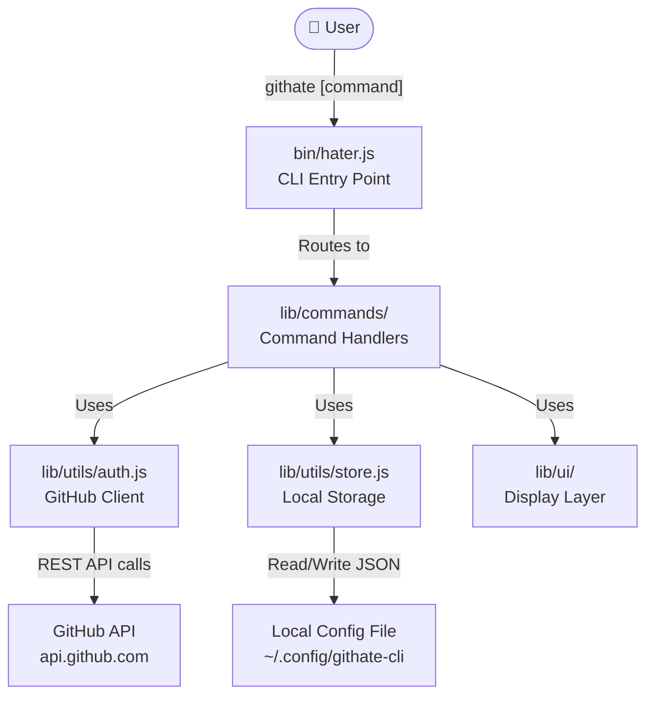
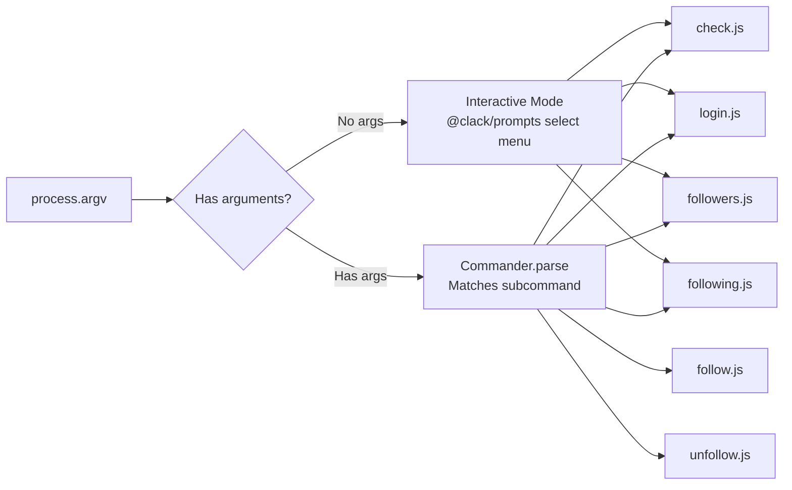
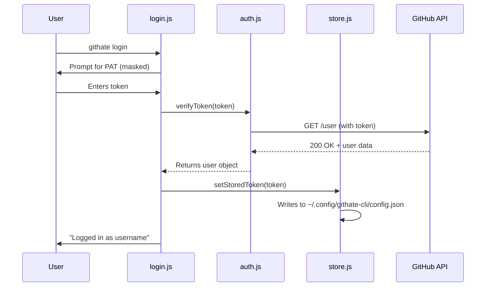
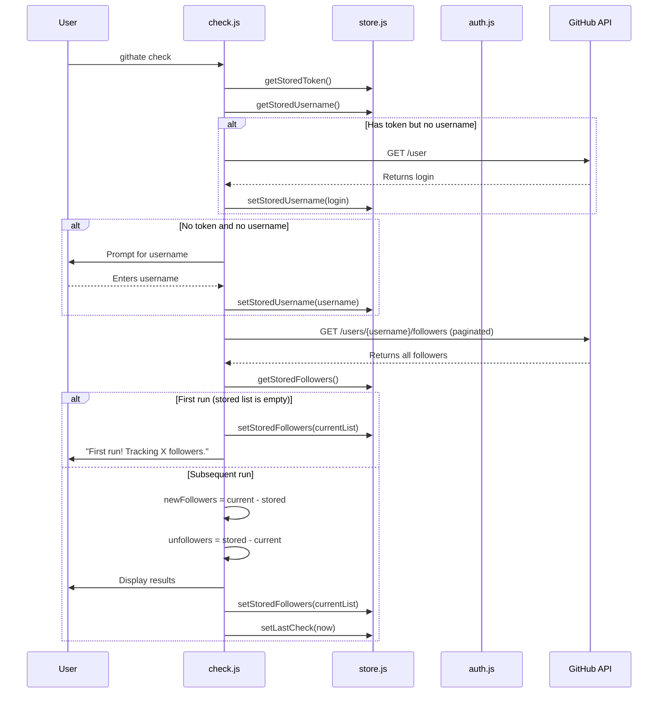
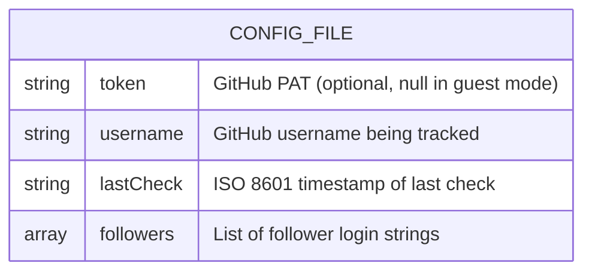

# GitHate CLI — Complete Architecture & Code Guide

> **Goal of this document:** Explain every single file, every dependency, every API call, and every design decision in enough detail that you could rebuild this project from scratch with zero AI assistance.

---

## Table of Contents

1. [Project Overview](#1-project-overview)
2. [Dependencies Deep Dive](#2-dependencies-deep-dive)
3. [Architecture — Level 0 (System Overview)](#3-architecture--level-0-system-overview)
4. [Architecture — Level 1 (Subsystem Diagrams)](#4-architecture--level-1-subsystem-diagrams)
5. [File-by-File Code Walkthrough](#5-file-by-file-code-walkthrough)
   - [5.1 package.json](#51-packagejson)
   - [5.2 bin/hater.js — CLI Entry Point](#52-binhaterjs--cli-entry-point)
   - [5.3 lib/utils/store.js — Local Data Persistence](#53-libutilsstorejs--local-data-persistence)
   - [5.4 lib/utils/auth.js — GitHub Authentication](#54-libutilsauthjs--github-authentication)
   - [5.5 lib/ui/art.js — ASCII Art Generation](#55-libuiartjs--ascii-art-generation)
   - [5.6 lib/ui/display.js — Console Output Helpers](#56-libuidisplayjs--console-output-helpers)
   - [5.7 lib/commands/login.js — Login Command](#57-libcommandsloginjs--login-command)
   - [5.8 lib/commands/check.js — Hater Detection (Core Feature)](#58-libcommandscheckjs--hater-detection-core-feature)
   - [5.9 lib/commands/followers.js — List Followers](#59-libcommandsfollowersjs--list-followers)
   - [5.10 lib/commands/following.js — List Following](#510-libcommandsfollowingjs--list-following)
   - [5.11 lib/commands/follow.js — Follow a User](#511-libcommandsfollowjs--follow-a-user)
   - [5.12 lib/commands/unfollow.js — Unfollow a User](#512-libcommandsunfollowjs--unfollow-a-user)
6. [GitHub API Reference](#6-github-api-reference)
7. [Data Flow: The "check" Command End-to-End](#7-data-flow-the-check-command-end-to-end)
8. [How to Rebuild From Scratch](#8-how-to-rebuild-from-scratch)

---

## 1. Project Overview

**GitHate** (package name: `githate`) is a Node.js CLI tool that tracks who unfollowed you on GitHub. It stores your follower list locally and diffs it against the live GitHub API on each run, revealing "haters" (unfollowers) and new fans.

**How it works at a high level:**

1. User authenticates with a GitHub Personal Access Token (PAT), which gets saved locally.
2. On first `check`, the tool fetches all followers and saves them to a local JSON config file.
3. On subsequent `check` runs, it fetches followers again, compares them to the saved list, and prints out who left (unfollowers) and who joined (new followers).
4. The local list is then updated to the current state.

---

## 2. Dependencies Deep Dive

Every npm package used and **why** it's there:

| Package           | Version   | Purpose                                           | Why This One?                                                                                                                |
| ----------------- | --------- | ------------------------------------------------- | ---------------------------------------------------------------------------------------------------------------------------- |
| `commander`       | `^14.0.3` | CLI framework — parses commands, arguments, flags | Industry standard for Node CLIs. Provides `.command()`, `.option()`, `.action()` pattern.                                    |
| `@octokit/rest`   | `^20.0.0` | Official GitHub REST API client                   | Handles auth headers, pagination, rate limiting. Made by GitHub themselves.                                                  |
| `conf`            | `^15.1.0` | Persistent local config storage                   | Saves JSON to OS-specific config directory (e.g., `~/.config/githate-cli/config.json` on Linux). Schema validation built-in. |
| `@clack/prompts`  | `^1.0.0`  | Beautiful interactive terminal prompts            | Modern alternative to `inquirer`. Provides `select`, `text`, `password`, `spinner`, etc. with a clean look.                  |
| `chalk`           | `^5.6.2`  | Terminal string styling (colors, bold, etc.)      | Used for styled output like `chalk.red.bold("error")`. Version 5+ is ESM-only.                                               |
| `picocolors`      | `^1.1.1`  | Lightweight terminal colors                       | Smaller/faster alternative to chalk, used alongside it for simple color needs like `color.green("+")`.                       |
| `boxen`           | `^8.0.1`  | Draw boxes around terminal text                   | Used for the error display — creates a red-bordered box with padding.                                                        |
| `figlet`          | `^1.10.0` | Generate ASCII art text from strings              | Converts "GITHATE" into large ASCII block letters. Supports many fonts.                                                      |
| `gradient-string` | `^3.0.0`  | Apply color gradients to terminal strings         | Makes the ASCII art banner colorful — uses prebuilt gradients like `retro` and `passion`.                                    |

---

## 3. Architecture — Level 0 (System Overview)

This is the top-level view. The user interacts with the CLI, which routes to command handlers. Those handlers use utility modules to talk to GitHub and persist data locally.



---

## 4. Architecture — Level 1 (Subsystem Diagrams)

### L1-A: Command Routing

How `bin/hater.js` decides what to run:



### L1-B: Authentication Flow



### L1-C: Hater Detection Algorithm



### L1-D: Data Storage Schema



The config file lives at the OS-specific config path determined by the `conf` library:

- **macOS**: `~/Library/Preferences/githate-cli-nodejs/config.json`
- **Linux**: `~/.config/githate-cli-nodejs/config.json`
- **Windows**: `%APPDATA%/githate-cli-nodejs/config.json`

---

## 5. File-by-File Code Walkthrough

### 5.1 `package.json`

```json
{
  "name": "githate",
  "version": "1.1.1",
  "description": "A CLI tool to track who unfollowed you on GitHub.",
  "main": "index.js",
  "type": "module",
  "bin": {
    "githate": "bin/hater.js"
  },
  "scripts": {
    "test": "echo \"Error: no test specified\" && exit 1"
  },
  "keywords": ["github", "cli", "unfollowers", "tracker"],
  "author": "",
  "license": "ISC",
  "dependencies": {
    "@clack/prompts": "^1.0.0",
    "@octokit/rest": "^20.0.0",
    "boxen": "^8.0.1",
    "chalk": "^5.6.2",
    "commander": "^14.0.3",
    "conf": "^15.1.0",
    "figlet": "^1.10.0",
    "githate": "^1.0.1",
    "gradient-string": "^3.0.0",
    "picocolors": "^1.1.1"
  }
}
```

**Key things to note:**

- **`"type": "module"`** — This is critical. It tells Node.js to treat all `.js` files as ES Modules (so you use `import`/`export` instead of `require`/`module.exports`). Without this, every `import` statement in the project would fail.
- **`"bin": { "githate": "bin/hater.js" }`** — This maps the shell command `githate` to the file `bin/hater.js`. When a user runs `npm install -g githate`, npm creates a symlink so that typing `githate` in the terminal executes `bin/hater.js`.
- **`"githate": "^1.0.1"` in dependencies** — This is the package depending on itself (likely left over from testing the published npm package). Not strictly needed for local development.

---

### 5.2 `bin/hater.js` — CLI Entry Point

This is the file that runs when you type `githate` in your terminal.

```javascript
#!/usr/bin/env node
import { Command } from "commander";
import { readFileSync } from "node:fs";
import { join, dirname } from "node:path";
import { fileURLToPath } from "node:url";

const __dirname = dirname(fileURLToPath(import.meta.url));
const pkg = JSON.parse(
  readFileSync(join(__dirname, "../package.json"), "utf-8"),
);

const program = new Command();

program
  .name("githate")
  .description("Track who unfollowed you on GitHub")
  .version(pkg.version);

program
  .command("login")
  .description("Login to GitHub with a Personal Access Token")
  .action(async () => {
    const { login } = await import("../lib/commands/login.js");
    await login();
  });

program
  .command("check")
  .description("Check for new unfollowers")
  .action(async () => {
    const { check } = await import("../lib/commands/check.js");
    await check();
  });

program
  .command("followers")
  .description("List your followers")
  .action(async () => {
    const { followers } = await import("../lib/commands/followers.js");
    await followers();
  });

program
  .command("following")
  .description("List who you are following")
  .action(async () => {
    const { following } = await import("../lib/commands/following.js");
    await following();
  });

program
  .command("follow <username>")
  .description("Follow a user")
  .action(async (username) => {
    const { follow } = await import("../lib/commands/follow.js");
    await follow(username);
  });

program
  .command("unfollow <username>")
  .description("Unfollow a user")
  .action(async (username) => {
    const { unfollow } = await import("../lib/commands/unfollow.js");
    await unfollow(username);
  });

// Handle default command (interactive mode)
if (process.argv.length < 3) {
  (async () => {
    const { select, isCancel, cancel } = await import("@clack/prompts");
    const { displayIntro } = await import("../lib/ui/display.js");

    // Clear screen for a fresh start
    console.clear();
    displayIntro();

    const command = await select({
      message: "What would you like to do?",
      options: [
        { value: "check", label: "🕵️  Check for Haters" },
        { value: "login", label: "🔑 Login" },
        { value: "followers", label: "👥 List Followers" },
        { value: "following", label: "👀 List Following" },
        { value: "quit", label: "🚪 Quit" },
      ],
    });

    if (isCancel(command) || command === "quit") {
      cancel("Bye!");
      process.exit(0);
    }

    if (command === "check") {
      const { check } = await import("../lib/commands/check.js");
      await check();
    } else if (command === "login") {
      const { login } = await import("../lib/commands/login.js");
      await login();
    } else if (command === "followers") {
      const { followers } = await import("../lib/commands/followers.js");
      await followers();
    } else if (command === "following") {
      const { following } = await import("../lib/commands/following.js");
      await following();
    }
  })();
} else {
  program.parse(process.argv);
}
```

**Line-by-line explanation:**

1. **`#!/usr/bin/env node`** — The "shebang" line. Tells the OS to run this file with Node.js. Required for any CLI tool that runs directly (not via `node filename.js`).

2. **`import { Command } from "commander"`** — Commander is the CLI framework. `Command` is the main class you use to define your CLI program, its commands, and their actions.

3-5. **`readFileSync`, `join`, `dirname`, `fileURLToPath`** — These Node.js built-in modules are used to construct the path to `package.json`. In ESM, there's no `__dirname` by default (that's a CommonJS thing), so you have to derive it from `import.meta.url`.

7-10. **Deriving `__dirname` and reading `package.json`** — `import.meta.url` gives you the file's URL (like `file:///path/to/bin/hater.js`). `fileURLToPath()` converts it to a normal path. `dirname()` gets the directory. Then it reads `package.json` to extract the version number dynamically.

12-17. **Setting up the Commander program** — Creates a new `Command` instance, sets the name to `githate`, adds a description, and sets the version (used when user runs `githate --version`).

19-65. **Command definitions** — Each block defines a subcommand:

- `.command("name")` registers the command name
- `.description("...")` adds help text
- `.action(async () => { ... })` defines what runs when the command is invoked
- **Dynamic `import()`** is used inside each action instead of top-level imports. This is a **performance optimization** — it means the tool only loads the code for the command you actually run, making startup faster.
- For `follow` and `unfollow`, the `<username>` in `.command("follow <username>")` defines a **required positional argument**. Commander automatically passes it to the action callback.

67-109. **Interactive mode** — The `if (process.argv.length < 3)` check detects when the user runs just `githate` with no arguments. `process.argv` is always `["node", "script.js", ...args]`, so length < 3 means no args. In this case:

- Clears the screen
- Shows the ASCII art banner
- Presents a `select()` menu from `@clack/prompts` with emoji-labeled options
- `isCancel()` handles Ctrl+C gracefully
- Routes to the selected command handler

---

### 5.3 `lib/utils/store.js` — Local Data Persistence

This file is the **entire data layer**. Every piece of state the app remembers between runs is managed here.

```javascript
import Conf from "conf";

const schema = {
  token: {
    type: "string",
  },
  username: {
    type: "string",
  },
  followers: {
    type: "array",
    default: [],
  },
  lastCheck: {
    type: "string",
  },
};

const config = new Conf({
  projectName: "githate-cli",
  schema,
});

export const getStoredToken = () => config.get("token");
export const setStoredToken = (token) => config.set("token", token);
export const deleteStoredToken = () => config.delete("token");

export const getStoredUsername = () => config.get("username");
export const setStoredUsername = (username) => config.set("username", username);
export const deleteStoredUsername = () => config.delete("username");

export const getStoredFollowers = () => config.get("followers");
export const setStoredFollowers = (followers) =>
  config.set("followers", followers);

export const setLastCheck = (date) => config.set("lastCheck", date);
export const getLastCheck = () => config.get("lastCheck");

export const clearStore = () => config.clear();
```

**How `conf` works under the hood:**

The `conf` library creates a JSON file at the OS-specific config directory. When you call `config.set("token", "abc123")`, it:

1. Reads the existing JSON file from disk
2. Sets the `token` property to `"abc123"`
3. Writes the updated JSON back to disk atomically (using a temp file + rename to prevent corruption)

The `schema` object provides **validation**. If you try to `config.set("token", 123)`, it would throw because the schema says `token` must be a `"string"`. The `followers` field has `default: []`, meaning `config.get("followers")` returns `[]` if never set (instead of `undefined`).

**The config file on disk looks like this:**

```json
{
  "token": "ghp_xxxxxxxxxxxxxxxxxxxx",
  "username": "GithubAnant",
  "followers": ["user1", "user2", "user3"],
  "lastCheck": "2026-02-11T15:30:00.000Z"
}
```

**Exported functions are simple getter/setter wrappers:**

- `getStoredToken()` / `setStoredToken(token)` / `deleteStoredToken()` — Manage the GitHub PAT.
- `getStoredUsername()` / `setStoredUsername(username)` / `deleteStoredUsername()` — The username being tracked. `deleteStoredUsername()` is called when a 404 is returned (invalid username), so the app asks again next time.
- `getStoredFollowers()` / `setStoredFollowers(followers)` — The array of follower login strings. This is the "previous state" used for diffing.
- `getLastCheck()` / `setLastCheck(date)` — ISO timestamp of the last successful check.
- `clearStore()` — Nukes everything (not currently exposed as a CLI command, but available).

---

### 5.4 `lib/utils/auth.js` — GitHub Authentication

Manages the Octokit (GitHub API client) instance.

```javascript
import { Octokit } from "@octokit/rest";
import { getStoredToken } from "./store.js";
import { displayError } from "../ui/display.js";

let octokitInstance = null;

export const getOctokit = () => {
  if (octokitInstance) return octokitInstance;

  const token = getStoredToken();
  // Valid token? Authenticated. No token? Guest mode.
  octokitInstance = new Octokit({ auth: token });
  return octokitInstance;
};

export const verifyToken = async (token) => {
  try {
    const octokit = new Octokit({ auth: token });
    const { data } = await octokit.rest.users.getAuthenticated();
    return data;
  } catch (error) {
    throw new Error("Invalid token or network error.");
  }
};
```

**Line-by-line explanation:**

1. **`import { Octokit } from "@octokit/rest"`** — Octokit is the official GitHub SDK. It wraps every GitHub REST API endpoint as a JavaScript method. e.g., `octokit.rest.users.getAuthenticated()` → `GET https://api.github.com/user`.

2. **`let octokitInstance = null`** — This is a **singleton pattern**. The Octokit instance is created once and reused for all subsequent calls within the same CLI run. This avoids creating multiple HTTP clients.

7-13. **`getOctokit()`** —

- Checks if an instance already exists (returns it if so).
- Reads the token from local storage.
- Creates a new `Octokit({ auth: token })`. If `token` is `undefined` (user never logged in), Octokit still works — it just makes **unauthenticated requests**, which are limited to 60 requests/hour instead of 5,000.
- This is what enables "Guest Mode" — the app can check public followers for any username without auth, just with rate limit restrictions.

16-24. **`verifyToken(token)`** —

- Creates a **new, separate** Octokit instance with the provided token (doesn't use the singleton, because we're testing a token that hasn't been saved yet).
- Calls `GET /user` which returns the authenticated user's profile. This endpoint requires valid authentication, so if the token is bad, it throws a 401 error.
- On success, returns the user data object (which has `.login`, `.id`, `.avatar_url`, etc.).
- On failure, throws a generic error message.

---

### 5.5 `lib/ui/art.js` — ASCII Art Generation

Generates the big flashy text banners.

```javascript
import figlet from "figlet";
import gradient from "gradient-string";
import { passion } from "gradient-string";

export const getBanner = (text = "GITHATE") => {
  const art = figlet.textSync(text, {
    font: "ANSI Shadow",
    horizontalLayout: "default",
    verticalLayout: "default",
  });
  return gradient.retro(art);
};

export const getHaterReveal = (text) => {
  const art = figlet.textSync(text, {
    font: "DOS Rebel",
  });
  return passion(art);
};
```

**How figlet works:**

`figlet.textSync("GITHATE", { font: "ANSI Shadow" })` converts the string "GITHATE" into a multi-line ASCII art block using the "ANSI Shadow" font definition file. The font file is bundled with the `figlet` npm package and defines how each character looks as a grid of text characters. The output is a plain string with newlines, for example:

```
 ██████╗ ██╗████████╗██╗  ██╗ █████╗ ████████╗███████╗
██╔════╝ ██║╚══██╔══╝██║  ██║██╔══██╗╚══██╔══╝██╔════╝
██║  ███╗██║   ██║   ███████║███████║   ██║   █████╗
██║   ██║██║   ██║   ██╔══██║██╔══██║   ██║   ██╔══╝
╚██████╔╝██║   ██║   ██║  ██║██║  ██║   ██║   ███████╗
 ╚═════╝ ╚═╝   ╚═╝   ╚═╝  ╚═╝╚═╝  ╚═╝   ╚═╝   ╚══════╝
```

**How gradient-string works:**

`gradient.retro(art)` takes that ASCII art string and applies ANSI color escape codes to each character, transitioning through a predefined "retro" color palette (warm oranges/yellows). The `passion` gradient uses reds/pinks/oranges — used for the dramatic "THE HATERS" reveal.

**Two exported functions:**

- **`getBanner(text = "GITHATE")`** — The app header. "ANSI Shadow" font + "retro" gradient. Shown at the start of every command.
- **`getHaterReveal(text)`** — The dramatic reveal when unfollowers are found. "DOS Rebel" font (blockier, more aggressive) + "passion" gradient (reds). Only shown in `check.js` when there are unfollowers.

---

### 5.6 `lib/ui/display.js` — Console Output Helpers

Centralizes ALL styled terminal output. No other file should call `console.log` with styling directly (though some commands do for simple things).

```javascript
import { spinner, note, log } from "@clack/prompts";
import color from "picocolors";
import boxen from "boxen";
import chalk from "chalk";
import { getBanner } from "./art.js";

const TIPS = [
  "Run 'githate check' often to catch them red-handed.",
  "Use 'githate login' to authenticate securely.",
  "Don't take it personally, it's just business.",
  "Haters gonna hate, creators gonna create.",
];

const getRandomTip = () => TIPS[Math.floor(Math.random() * TIPS.length)];

export const displayIntro = () => {
  console.log(getBanner());

  console.log(chalk.bold("Tips for getting started:"));
  console.log(chalk.dim("1. Login with your GitHub PAT."));
  console.log(chalk.dim("2. Run check to see your followers."));
  console.log(chalk.dim(`3. ${getRandomTip()}\n`));
};

export const displayOutro = (message) => {
  console.log("");
  console.log(` ${chalk.green("➜")} ${chalk.bold(message)}\n`);
};

export const displayError = (message) => {
  console.log(
    boxen(chalk.red.bold(message), {
      padding: 1,
      margin: 1,
      borderStyle: "round",
      borderColor: "red",
      title: "ERROR",
      titleAlignment: "center",
    }),
  );
};

export const displaySuccess = (message) => {
  console.log(` ${chalk.green("✔")} ${message}`);
};

export const displayInfo = (message) => {
  console.log(` ${chalk.blue("✦")} ${chalk.dim(message)}`);
};

export const displayWarning = (message) => {
  console.log(` ${chalk.yellow("!")} ${chalk.yellow(message)}`);
};

export const displayHater = (username) => {
  console.log(
    ` ${chalk.red("💔")} ${chalk.red.bold(username)} unfollowed you!`,
  );
  console.log(`    ${chalk.dim(`https://github.com/${username}`)}`);
};

export const createSpinner = () => {
  return spinner();
};
```

**Function-by-function breakdown:**

- **`TIPS` array + `getRandomTip()`** — A small touch of personality. Each time the app starts, it shows a randomly selected tip as the 3rd bullet point under "Tips for getting started." `Math.floor(Math.random() * TIPS.length)` picks a random index.

- **`displayIntro()`** — Called at the start of almost every command. Prints the ASCII art banner (from `art.js`), then 3 tips. The third tip is randomized.

- **`displayOutro(message)`** — End-of-command message. Shows a green arrow `➜` followed by a bold summary message like "Check complete & database updated."

- **`displayError(message)`** — Wraps the error message in a red rounded box using `boxen`. The box has:
  - `padding: 1` — 1 character of space inside the box
  - `margin: 1` — 1 line of space outside the box
  - `borderStyle: "round"` — Rounded corners
  - `borderColor: "red"` — Red border
  - `title: "ERROR"` — Centered title at the top of the box

- **`displaySuccess(message)`** — Green checkmark `✔` + message.

- **`displayInfo(message)`** — Blue diamond `✦` + dimmed message. Used for non-critical info like "Last check: ..."

- **`displayWarning(message)`** — Yellow exclamation `!` + yellow message.

- **`displayHater(username)`** — The unfollower display. Shows a red broken heart `💔`, the username in bold red, "unfollowed you!", and below it a dimmed link to their GitHub profile.

- **`createSpinner()`** — Returns a clack `spinner()` instance. The spinner has `.start("message")` and `.stop("message")` methods that show/hide an animated spinner in the terminal.

---

### 5.7 `lib/commands/login.js` — Login Command

Handles GitHub PAT authentication.

```javascript
import { password, isCancel, cancel } from "@clack/prompts";
import { verifyToken } from "../utils/auth.js";
import { setStoredToken } from "../utils/store.js";
import {
  displayIntro,
  displaySuccess,
  displayError,
  displayOutro,
  createSpinner,
} from "../ui/display.js";

export const login = async () => {
  displayIntro();

  const token = await password({
    message: "Enter your GitHub Personal Access Token",
    mask: "*",
  });

  if (isCancel(token)) {
    cancel("Login cancelled");
    process.exit(0);
  }

  const s = createSpinner();
  s.start("Verifying token...");

  try {
    const user = await verifyToken(token);
    setStoredToken(token);
    s.stop("Token verified!");
    displaySuccess(`Logged in as ${user.login}`);
  } catch (error) {
    s.stop("Verification failed");
    displayError(error.message);
    process.exit(1);
  }

  displayOutro("You are ready to track the haters!");
};
```

**Step-by-step flow:**

1. Shows the banner intro.
2. `password()` from `@clack/prompts` — like `text()` but masks input with `*` characters. The user types their PAT and it shows as `****`. Returns the actual typed string.
3. `isCancel(token)` — checks if user pressed Ctrl+C. If so, exits gracefully.
4. Starts a spinner that shows "Verifying token...".
5. Calls `verifyToken(token)` which makes a real API call to GitHub (`GET /user`) to confirm the token works.
6. If valid: saves the token to the local config via `setStoredToken()`, stops the spinner with success, shows the username.
7. If invalid: stops the spinner with failure, shows the error in a red box, exits with code 1.
8. Shows the outro message.

---

### 5.8 `lib/commands/check.js` — Hater Detection (Core Feature)

This is the **main feature** of the entire tool. It's the longest file and the most complex logic.

```javascript
import { getOctokit } from "../utils/auth.js";
import {
  getStoredFollowers,
  setStoredFollowers,
  setLastCheck,
  getLastCheck,
} from "../utils/store.js";
import {
  displayIntro,
  displaySuccess,
  displayError,
  createSpinner,
  displayInfo,
  displayWarning,
  displayOutro,
  displayHater,
} from "../ui/display.js";
import { getHaterReveal } from "../ui/art.js";
import color from "picocolors";
import chalk from "chalk";

const sleep = (ms) => new Promise((resolve) => setTimeout(resolve, ms));

export const check = async () => {
  displayIntro();
  const s = createSpinner();
  let targetUser;

  try {
    const octokit = getOctokit();
    const { getStoredToken, getStoredUsername, setStoredUsername } =
      await import("../utils/store.js");
    const { text, isCancel, cancel } = await import("@clack/prompts");
    const chalk = (await import("chalk")).default;

    targetUser = getStoredUsername();
    const token = getStoredToken();

    // If we have a token, we can get the username from the authenticated user
    if (token && !targetUser) {
      try {
        const { data } = await octokit.rest.users.getAuthenticated();
        targetUser = data.login;
        setStoredUsername(targetUser);
      } catch (e) {
        // Token might be invalid, ignore and fall through
      }
    }

    // If still no username (Guest Mode first run), ask for it
    if (!targetUser) {
      const username = await text({
        message: "Enter your GitHub username to track:",
        placeholder: "",
        validate: (value) => {
          if (!value) return "Username is required!";
        },
      });

      if (isCancel(username)) {
        cancel("Operation cancelled.");
        return;
      }
      targetUser = username;
      setStoredUsername(targetUser);
    }

    s.start(`Fetching followers for ${targetUser}...`);

    const currentFollowers = await octokit.paginate(
      octokit.rest.users.listFollowersForUser,
      {
        username: targetUser,
        per_page: 100,
      },
    );
    const currentFollowerLogins = currentFollowers.map((f) => f.login);

    s.stop("Followers fetched");

    const storedFollowers = getStoredFollowers();
    const lastCheck = getLastCheck();

    if (storedFollowers.length === 0) {
      displayInfo(
        "First run detected! Storing current followers for future checks.",
      );
      setStoredFollowers(currentFollowerLogins);
      setLastCheck(new Date().toISOString());
      displayOutro(`Tracking ${currentFollowerLogins.length} followers.`);
      return;
    }

    // Find new followers
    const newFollowers = currentFollowerLogins.filter(
      (login) => !storedFollowers.includes(login),
    );

    // Find unfollowers (The Haters)
    const unfollowers = storedFollowers.filter(
      (login) => !currentFollowerLogins.includes(login),
    );

    console.log("");
    if (lastCheck) {
      displayInfo(`Last check: ${new Date(lastCheck).toLocaleString()}`);
    }
    console.log("");

    if (newFollowers.length > 0) {
      displaySuccess(`New Followers (+${newFollowers.length}):`);
      newFollowers.forEach((login) =>
        console.log(` ${color.green("+")} ${login}`),
      );
      console.log("");
    } else {
      console.log(color.dim("No new followers."));
    }

    if (unfollowers.length > 0) {
      console.log("\n");
      console.log(getHaterReveal("THE HATERS"));
      console.log("\n");

      for (const login of unfollowers) {
        await sleep(500); // Dramatic pause
        displayHater(login);
      }

      console.log("");
      displayInfo(
        'Consider using "githate unfollow <username>" if you want to respond.',
      );
    } else {
      console.log(color.dim("No new unfollowers. Everyone still loves you!"));
    }

    // Update store
    setStoredFollowers(currentFollowerLogins);
    setLastCheck(new Date().toISOString());

    displayOutro("Check complete & database updated.");
  } catch (error) {
    s.stop("Check failed");
    if (error.status === 403) {
      displayError(
        "API Rate Limit Exceeded.\nGuest mode is limited to 60 req/hr.\nRun 'githate login' to increase limits.",
      );
    } else if (error.status === 404) {
      displayError(`User '${targetUser}' not found.`);
      const { deleteStoredUsername } = await import("../utils/store.js");
      deleteStoredUsername(); // Reset so it asks again next time
      console.log("Invalid username cleared. Please run 'check' again.");
    } else {
      displayError(error.message);
    }
  }
};
```

**Detailed walkthrough:**

**Lines 22:** `sleep()` — A utility that returns a Promise that resolves after `ms` milliseconds. Used for a 500ms dramatic pause between revealing each unfollower.

**Lines 29-34: Initialization**

- Gets the Octokit instance (which may or may not have a token).
- Dynamically imports additional store functions and clack prompts (these are only needed in specific branches of the logic, so lazy-loading them saves startup time in the common case).

**Lines 36-66: Username Resolution (3 strategies)**

This is a cascading fallback:

1. **Strategy 1 (line 36):** Check if a username is already stored locally (`getStoredUsername()`). If the user has run `check` before, it will be saved.
2. **Strategy 2 (lines 40-48):** If there's a token but no username, call `GET /user` to get the authenticated user's login name, then save it.
3. **Strategy 3 (lines 51-66):** If there's neither a token nor a saved username (pure guest mode, first run), prompt the user to type in a username. This uses `@clack/prompts`'s `text()` function with validation requiring a non-empty value.

**Lines 68-77: Fetching Current Followers**

```javascript
const currentFollowers = await octokit.paginate(
  octokit.rest.users.listFollowersForUser,
  { username: targetUser, per_page: 100 },
);
```

This is the most important API call. `octokit.paginate()` is a method that **automatically follows pagination**. The GitHub API returns max 100 results per page. If a user has 350 followers, this makes 4 API requests automatically (pages 1-4) and returns all results combined in a single array.

Each item in the array is a GitHub User object with properties like `{ login: "username", id: 12345, avatar_url: "...", ... }`. Line 77 maps this down to just the login strings: `["user1", "user2", ...]`.

**Lines 81-92: First Run Detection**

If `storedFollowers` is empty (returns `[]` from the `conf` default), this is the first time running `check`. In this case, the tool just saves the current followers and exits — it needs a baseline to compare against.

**Lines 94-102: The Diff — The Core Algorithm**

```javascript
// New followers = people in current list who weren't in stored list
const newFollowers = currentFollowerLogins.filter(
  (login) => !storedFollowers.includes(login),
);

// Unfollowers = people in stored list who aren't in current list
const unfollowers = storedFollowers.filter(
  (login) => !currentFollowerLogins.includes(login),
);
```

This is a **set difference** operation implemented with Array `.filter()` and `.includes()`:

- `newFollowers` = `currentList \ storedList` (in current but not in stored)
- `unfollowers` = `storedList \ currentList` (in stored but not in current)

**Lines 110-136: Display Results**

- New followers get a green `+` prefix.
- Unfollowers get the dramatic treatment: the "THE HATERS" ASCII art banner (via `getHaterReveal()`), then each unfollower is revealed one at a time with a 500ms delay using `await sleep(500)`. This is purely for dramatic effect.

**Lines 138-140: Update Store**

After displaying results, the store is updated with the current follower list and timestamp. This means the _next_ check will compare against _this_ run's data.

**Lines 143-156: Error Handling**

Three specific error cases:

- **403 (Rate Limit):** The user is in guest mode and has exceeded 60 requests/hour. The error message tells them to run `githate login`.
- **404 (User Not Found):** The stored username doesn't exist on GitHub. The app deletes the stored username so the next run will ask for a new one.
- **Everything else:** Generic error display.

---

### 5.9 `lib/commands/followers.js` — List Followers

```javascript
import { getOctokit } from "../utils/auth.js";
import {
  displayIntro,
  displayOutro,
  createSpinner,
  displayError,
} from "../ui/display.js";
import color from "picocolors";

export const followers = async () => {
  displayIntro();
  const s = createSpinner();

  try {
    const octokit = getOctokit();
    s.start("Fetching followers...");

    const followersList = await octokit.paginate(
      octokit.rest.users.listFollowersForAuthenticatedUser,
      {
        per_page: 100,
      },
    );

    s.stop(`Found ${followersList.length} followers`);

    if (followersList.length === 0) {
      displayOutro("You have no followers yet.");
      return;
    }

    console.log(""); // New line
    followersList.forEach((follower) => {
      console.log(`${color.green("•")} ${follower.login}`);
    });
    console.log("");

    displayOutro("End of followers list");
  } catch (error) {
    s.stop("Failed to fetch followers");
    displayError(error.message);
  }
};
```

**Key difference from `check.js`:** This uses `listFollowersForAuthenticatedUser` (which hits `GET /user/followers`) — meaning it lists **your own** followers. This **requires authentication** (a valid PAT), unlike `check.js` which can work in guest mode by using `listFollowersForUser` (hits `GET /users/{username}/followers`, a public endpoint).

The `octokit.paginate()` handles pagination the same way. Each follower is printed with a green bullet point.

---

### 5.10 `lib/commands/following.js` — List Following

```javascript
import { getOctokit } from "../utils/auth.js";
import {
  displayIntro,
  displayOutro,
  createSpinner,
  displayError,
} from "../ui/display.js";
import color from "picocolors";

export const following = async () => {
  displayIntro();
  const s = createSpinner();

  try {
    const octokit = getOctokit();
    s.start("Fetching following list...");

    const followingList = await octokit.paginate(
      octokit.rest.users.listFollowedByAuthenticated,
      {
        per_page: 100,
      },
    );

    s.stop(`You are following ${followingList.length} users`);

    if (followingList.length === 0) {
      displayOutro("You are not following anyone.");
      return;
    }

    console.log(""); // New line
    followingList.forEach((user) => {
      console.log(`${color.blue("•")} ${user.login}`);
    });
    console.log("");

    displayOutro("End of following list");
  } catch (error) {
    s.stop("Failed to fetch following list");
    displayError(error.message);
  }
};
```

**Nearly identical to `followers.js`**, the differences being:

- Uses `listFollowedByAuthenticated` → `GET /user/following` (people **you** follow).
- Uses blue bullets (`color.blue("•")`) instead of green to visually distinguish the two lists.

---

### 5.11 `lib/commands/follow.js` — Follow a User

```javascript
import { getOctokit } from "../utils/auth.js";
import {
  displayIntro,
  displaySuccess,
  displayError,
  createSpinner,
} from "../ui/display.js";

export const follow = async (username) => {
  displayIntro();
  const s = createSpinner();

  try {
    const octokit = getOctokit();
    s.start(`Following ${username}...`);

    await octokit.rest.users.follow({
      username,
    });

    s.stop(`Followed ${username}`);
    displaySuccess(`Successfully followed ${username}`);
  } catch (error) {
    s.stop(`Failed to follow ${username}`);
    displayError(error.message);
  }
};
```

**Simple wrapper around the GitHub API:**

- `octokit.rest.users.follow({ username })` → `PUT /user/following/{username}`
- This is a **write operation** — it requires a PAT with the `user:follow` scope.
- On success, the response is `204 No Content` (GitHub sends no body). Octokit doesn't throw, so the code moves to the success display.
- The `username` parameter comes from the Commander argument parser in `bin/hater.js` (from `githate follow <username>`).

---

### 5.12 `lib/commands/unfollow.js` — Unfollow a User

```javascript
import { getOctokit } from "../utils/auth.js";
import {
  displayIntro,
  displaySuccess,
  displayError,
  createSpinner,
} from "../ui/display.js";

export const unfollow = async (username) => {
  displayIntro();
  const s = createSpinner();

  try {
    const octokit = getOctokit();
    s.start(`Unfollowing ${username}...`);

    await octokit.rest.users.unfollow({
      username,
    });

    s.stop(`Unfollowed ${username}`);
    displaySuccess(`Successfully unfollowed ${username}`);
  } catch (error) {
    s.stop(`Failed to unfollow ${username}`);
    displayError(error.message);
  }
};
```

**Mirror image of `follow.js`:**

- `octokit.rest.users.unfollow({ username })` → `DELETE /user/following/{username}`
- Same error handling, same flow, just a different HTTP method.

---

## 6. GitHub API Reference

Every API endpoint the app uses, what triggers it, and what it returns:

| Command                                  | HTTP Method | Endpoint                      | Octokit Method                            | Auth Required?               | What it Returns                             |
| ---------------------------------------- | ----------- | ----------------------------- | ----------------------------------------- | ---------------------------- | ------------------------------------------- |
| `login`                                  | `GET`       | `/user`                       | `users.getAuthenticated()`                | ✅ Yes                       | Authenticated user's profile object         |
| `check`                                  | `GET`       | `/users/{username}/followers` | `users.listFollowersForUser`              | ❌ No (public)               | Array of user objects (paginated, 100/page) |
| `check` (with token, no stored username) | `GET`       | `/user`                       | `users.getAuthenticated()`                | ✅ Yes                       | Authenticated user's profile object         |
| `followers`                              | `GET`       | `/user/followers`             | `users.listFollowersForAuthenticatedUser` | ✅ Yes                       | Array of user objects (paginated)           |
| `following`                              | `GET`       | `/user/following`             | `users.listFollowedByAuthenticated`       | ✅ Yes                       | Array of user objects (paginated)           |
| `follow`                                 | `PUT`       | `/user/following/{username}`  | `users.follow`                            | ✅ Yes (`user:follow` scope) | `204 No Content`                            |
| `unfollow`                               | `DELETE`    | `/user/following/{username}`  | `users.unfollow`                          | ✅ Yes (`user:follow` scope) | `204 No Content`                            |

**Rate Limits:**

- **Authenticated (with PAT):** 5,000 requests per hour
- **Unauthenticated (Guest Mode):** 60 requests per hour
- Rate limit info is returned in response headers: `X-RateLimit-Limit`, `X-RateLimit-Remaining`, `X-RateLimit-Reset`

**PAT Scopes Required:**

- `read:user` — Read user profile and follower data
- `user:follow` — Follow/unfollow users

---

## 7. Data Flow: The "check" Command End-to-End

Here's exactly what happens, in order, when you run `githate check` for the **second time** (after the first run has already stored followers):

```
1. User runs: githate check
2. bin/hater.js → process.argv has "check" → Commander routes to check.js
3. check.js: displayIntro() → prints ASCII banner + tips
4. check.js: getOctokit() → reads token from config file → creates Octokit client
5. check.js: getStoredUsername() → reads "username" from config file → "GithubAnant"
6. check.js: spinner.start("Fetching followers...")
7. check.js: octokit.paginate(listFollowersForUser, {username: "GithubAnant"})
   → Request:  GET https://api.github.com/users/GithubAnant/followers?per_page=100&page=1
   ← Response: [{ login: "user1" }, { login: "user2" }, ...] (up to 100)
   → Request:  GET https://api.github.com/users/GithubAnant/followers?per_page=100&page=2
   ← Response: [...] (if needed; paginate continues until empty page)
8. check.js: Maps API response to array of logins: ["user1", "user2", ...]
9. check.js: spinner.stop("Followers fetched")
10. check.js: getStoredFollowers() → reads "followers" array from config file
11. check.js: getLastCheck() → reads "lastCheck" timestamp from config file
12. check.js: DIFF:
    - newFollowers = currentLogins.filter(x => !storedLogins.includes(x))
    - unfollowers  = storedLogins.filter(x => !currentLogins.includes(x))
13. check.js: Display new followers (green), display unfollowers (red + art)
14. check.js: setStoredFollowers(currentLogins) → writes to config file
15. check.js: setLastCheck(new Date().toISOString()) → writes to config file
16. check.js: displayOutro("Check complete & database updated.")
```

---

## 8. How to Rebuild From Scratch

### Step 1: Initialize the project

```bash
mkdir githate && cd githate
npm init -y
```

Edit `package.json`:

- Set `"name": "githate"`
- Add `"type": "module"` (required for ES Module imports)
- Add `"bin": { "githate": "bin/hater.js" }`

### Step 2: Install dependencies

```bash
npm install commander @octokit/rest conf @clack/prompts chalk picocolors boxen figlet gradient-string
```

### Step 3: Create the directory structure

```bash
mkdir -p bin lib/commands lib/ui lib/utils
```

### Step 4: Build bottom-up

**Order matters. Build utilities first, then UI, then commands, then the entry point.**

1. **`lib/utils/store.js`** — Create a `Conf` instance with `projectName: "githate-cli"` and the schema (token, username, followers, lastCheck). Export getter/setter functions.

2. **`lib/utils/auth.js`** — Import `Octokit` and `getStoredToken`. Create a singleton `getOctokit()` that reads the token and returns an Octokit instance. Create `verifyToken(token)` that tests a token against `GET /user`.

3. **`lib/ui/art.js`** — Import `figlet` and `gradient-string`. Create `getBanner()` with "ANSI Shadow" font + `gradient.retro`. Create `getHaterReveal()` with "DOS Rebel" font + `passion` gradient.

4. **`lib/ui/display.js`** — Import chalk, boxen, picocolors, clack spinner, and your art.js. Create helper functions: `displayIntro`, `displayOutro`, `displayError`, `displaySuccess`, `displayInfo`, `displayWarning`, `displayHater`, `createSpinner`.

5. **`lib/commands/login.js`** — Use `@clack/prompts` `password()` to get the token, verify it with `verifyToken()`, save it with `setStoredToken()`.

6. **`lib/commands/check.js`** — The big one. Resolve username (3 strategies), fetch followers with `octokit.paginate()`, diff against stored list, display results, update store.

7. **`lib/commands/followers.js`** and **`lib/commands/following.js`** — Simple paginated list fetches.

8. **`lib/commands/follow.js`** and **`lib/commands/unfollow.js`** — Simple API wrappers.

9. **`bin/hater.js`** — Wire everything together with Commander. Add the shebang line. Add interactive mode fallback.

### Step 5: Make it executable and test

```bash
chmod +x bin/hater.js
node bin/hater.js          # Interactive mode
node bin/hater.js login    # Login
node bin/hater.js check    # 1st run: saves baseline
node bin/hater.js check    # 2nd run: shows diff
```

### Step 6: Publish to npm (optional)

```bash
npm login
npm publish
```

Users can then install with `npm install -g githate`.
